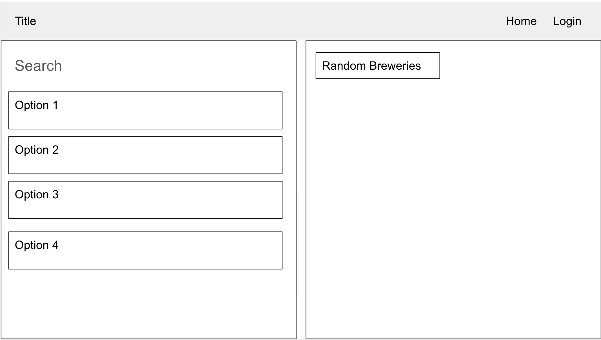
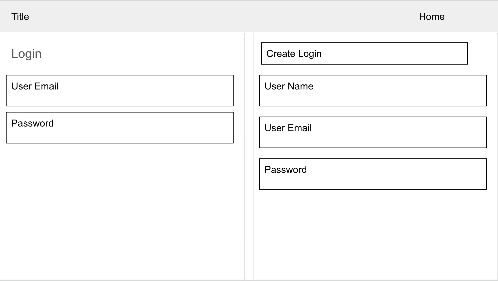
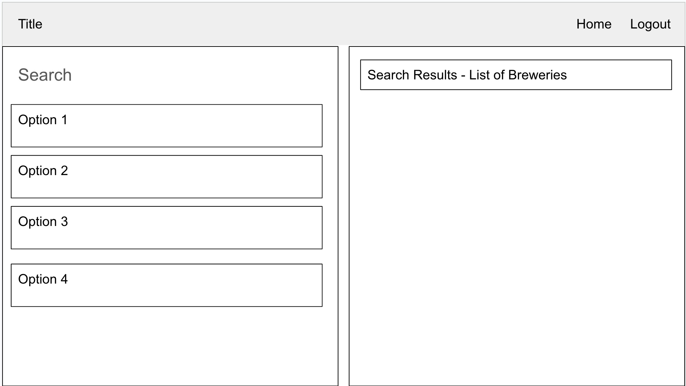
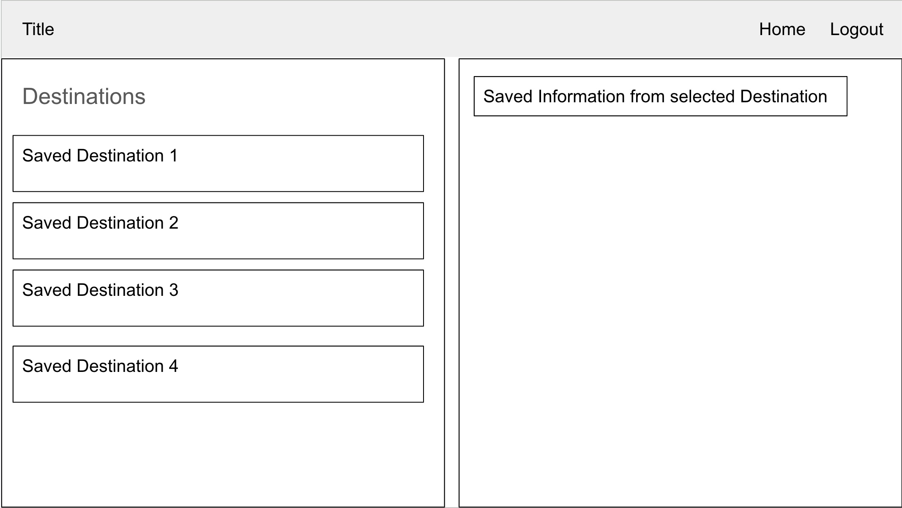

# LocalBreweries

# User Story

    I would like to have a page that shows me what breweries are near by
    I would like to be able to store some of the breweries for later reference
    I would like to have a sign in page so then i can see a private list of breweries i searched
    I would like a way to remove past searches or add additional breweries

# User Acceptance

    When a page display a list of breweries in an area
    When a site ask me to login 
    When i can save, update or remove breweries from a destination i looked up

## DESCRIPTION:

    We want to create a site that uses a API to lookup local breweries in the area that one can have a drink. We want the user to be able to login so they can save a list of breweries in a city they might want to visit. Then we want to be able to add or remove breweries from these lookup as the user decides too. 

## CONTENT:

* [DESCRIPTION](#description)
* [INSTALLATION](#installation)
* [LICENSE](#license)
* [CONTRIBUTING](#contributing)
* [TEST](#test)
* [QUESTIONS](#questions)

## INSTALLATION:

express
mysql2
sequelize
dotenv
handlebars
express-handlebars
express-session
bcrypt

## LICENSE:

ISC license

## CONTRIBUTING:

Github User: SJBDLT
Github User: Bkness 
Github User: Shawnclarke21

Server APIs:
https://api.openbrewerydb.org

Coding BootCamp Curriculum:
© 2022 edX Boot Camps LLC. All Rights Reserved.

## TEST:

Verified the api calls and make sure inputs, updates and deletion from database occur correctly

## QUESTIONS:

### User ID - SJBDLT, Bkness, Shawnclarke21
### User Email - sblake@blakeis.com, kbrandon863@gmail.com, srclark777@gmail.com

Heroku - https://radiant-fjord-87739-920e7bb79c22.herokuapp.com

repo - https://github.com/sjbdlt/LocalBreweries.git

        make fetch to a route listener for route call api get data then render

##Issue:

Certain breweries aren't saving to mypubs